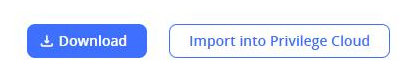
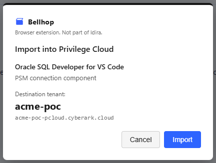

# Bellhop

Bellhop is a Chrome and Edge Manifest V3 extension that adds an "Import into Privilege Cloud" button to Idira Marketplace product pages, so an Idira (CyberArk) Privilege Cloud connection component or platform installs into the tenant's Privilege Cloud directly, replacing a manual download-then-upload round trip.

Not affiliated with or endorsed by Palo Alto Networks or CyberArk. This is an unsupported, spike-quality tool that writes directly into a production Privilege Cloud tenant — read [RELEASE-BLOCKERS.md](RELEASE-BLOCKERS.md) before pointing it at anything you care about.

## Why this isn't a trust boundary crossing

Idira is Palo Alto Networks' rebrand of CyberArk. Marketplace and Privilege Cloud aren't two vendors' products stitched together — they're sibling subdomains of one platform tenant, sharing one SSO session and cookie namespace. The extension moves an artifact from one service of that tenant to another, using a session the user already holds, inside a perimeter the user already trusts. A bellhop carries something you already own to a room you already have a key for, without leaving the building. Full argument: `docs/STORE-PERMISSIONS.md`, "Note for the reviewer".

## How it works

A content script in the marketplace iframe fetches the product's presigned S3 download URL on the same origin, using cookies it already has, and reads the tenant's CSRF token from `document.cookie` — it isn't HttpOnly, so this needs no permission at all. The artifact fetch and the import POST happen in the service worker rather than the content script, because a content script isn't CORS-exempt but an MV3 service worker holding a host permission for the target is. The extension declares no API permissions, and the worker requests exactly the two origins an import needs — the tenant's Privilege Cloud host, derived from the origin of the frame that sent the message, and the artifact's S3 host, derived at runtime from the download URL and never hardcoded. Full permission and origin-derivation model: `CLAUDE.md`.

## Screenshots

The button is injected next to the vendor's own Download button, cloned from it so it inherits the portal's styling:



Clicking it names the product, the package kind and the destination tenant before anything is written. The tenant shown here is a placeholder:



## Installing (no store listing yet)

Bellhop isn't published to the Chrome Web Store or Edge Add-ons, so one of the
three paths below is currently the only way to install it. Granted host
permissions and the confirmation dialog behave identically no matter which
path you use — install method doesn't change the security model (see
`CLAUDE.md`, "Permissions").

### 1. Load unpacked — most people

Get the files one of two ways.

**Download a release** — no toolchain, nothing to build:

1. Grab `bellhop-<version>.zip` from
   [Releases](https://github.com/aaearon/bellhop-marketplace-import/releases),
   newest at the top. Every release below `1.0.0` is marked a prerelease —
   deliberately, this is spike-quality — so GitHub's "latest release" link
   skips them and you want the list.
2. Extract it. The extracted folder *is* the extension directory — it holds
   `manifest.json` at its top level, so it is what you point the browser at
   below, in place of `extension/`.

The release zip is built by CI from a tagged commit and already contains the
compiled `lib/`, so it needs no build step.

**Or build from source** — for contributors, or to run unreleased changes:

```
npm install
npm run build
```

`npm run build` compiles `src/` into `extension/lib/`, which is gitignored
and absent from a fresh clone. Skip it and the extension still loads, but
fails at runtime with a module-not-found in the service worker's console and
no compile-time error (see `CLAUDE.md`, "Conventions"). This is the one way
to get a broken install that looks fine until you click the button, and it
is why the release zip is the safer choice if you are not changing code.

Then, whichever way you got the files:

- **Chrome:** `chrome://extensions` → toggle **Developer mode** (top right)
  → **Load unpacked** → select the `extension/` directory.
- **Edge:** `edge://extensions` → toggle **Developer mode** (left sidebar) →
  **Load unpacked** → select the same `extension/` directory.

Point the picker at the directory holding `manifest.json` — `extension/` in a
clone, or the extracted release folder. Not the repo root (no `manifest.json`
there) and not the zip itself (neither browser's unpacked loader accepts an
archive).

Each load-unpacked install gets its own extension ID, generated from a hash
of the absolute path to `extension/` on that machine — not the ID a store
listing or a signed CRX would have, and not the same across two machines or
two clones. `extension/manifest.json` has no `"key"` field, which is what
would pin it ([Chrome: Manifest — key
field](https://developer.chrome.com/docs/extensions/reference/manifest/key)).
This matters for the enterprise path below, which addresses an extension by
ID.

### 2. Enterprise / managed deployment (policy)

For organisations that disable developer mode, installation goes through the
browser's admin policies, and Chrome and Edge diverge:

**Chrome** has closed self-hosted installation for ordinary users on Windows
and macOS: "Only extensions hosted on and signed by the Chrome Web Store can
be directly installed by users" ([Chrome: Distribute your
extension](https://developer.chrome.com/docs/extensions/how-to/distribute)).
Self-hosted CRX + `update_url` still works there, but only on
enterprise-managed devices, via the `ExtensionInstallForcelist` policy
([Chrome Enterprise:
ExtensionInstallForcelist](https://chromeenterprise.google/policies/extension-install-forcelist/)):
each list entry is `<extension_id>;<update_url>`, where `update_url` points
to an XML update manifest (not the CRX file itself) hosted wherever you
control. On Linux, a user can still manually install an unpacked/unsigned
extension outside any policy.

**Edge is more permissive.** It supports the same self-hosted-CRX-plus-policy
path for managed devices
([`ExtensionInstallForcelist`](https://learn.microsoft.com/en-us/deployedge/microsoft-edge-policies/extensioninstallforcelist),
[self-hosting
guide](https://learn.microsoft.com/en-us/deployedge/microsoft-edge-manage-extensions-webstore)),
and can *also* force-install straight from the Chrome Web Store by pointing
the same policy's `update_url` at
`https://clients2.google.com/service/update2/crx` ([Edge: alternative
distribution
options](https://learn.microsoft.com/en-us/microsoft-edge/extensions/developer-guide/alternate-distribution-options))
— relevant only once/if Bellhop is actually listed there.

Either path needs a signed CRX, which nothing in this repo produces today —
`npm run package` builds a zip, not a CRX (see below). Generate one
separately: `chrome://extensions` (Developer mode) → **Pack extension**, or
from the command line, `google-chrome --pack-extension=path/to/extension`.
Confirmed on this machine: that command writes `extension.crx` and
`extension.pem` next to the packed folder. **Keep the `.pem`** — it's the
private key the CRX's ID is derived from; repacking without it generates a
new key pair and a different extension ID, breaking any policy that
addresses the old one, and there's no way to recover the old ID once the key
is lost.

Windows/macOS-specific requirements for this path (e.g. domain-join or MDM
enrollment) are documented on the policy pages linked above; they aren't
re-verified here since this is written from a Linux dev machine.

### 3. Building the zip yourself

```
npm run package
```

produces `dist/bellhop-<version>.zip` — the same artifact attached to each
release, so you only need this to package an untagged commit. Pushing a `v*`
tag runs it in CI and publishes the result; see `.github/workflows/release.yml`.

It's a Chrome Web Store / Edge Add-ons upload artifact, and — because it's just the same files as `extension/` zipped up —
it also works if you extract it and load the result unpacked (path 1). **It
is not a CRX.** Chrome and Edge don't accept a zip via drag-and-drop or any
other direct-install gesture; there's no shortcut from this file to an
installed extension without either a store upload or a load-unpacked step.

## Status

Confirmed:

- End-to-end import of one connection-component product into one live tenant, as a super admin — confirmation dialog, per-tenant optional permission grant, and CSRF handling all exercised. That run predates the current permission and CSRF shape, which has not yet been re-tested against a live tenant.

Untested:

- The platform (CPM/SRS) import path — implemented, never run against a live tenant.
- Any user below super admin.
- Two tenants authenticated at once. More than one CSRF token candidate fails closed rather than guessing.
- An artifact large enough to risk the service worker's ~30s idle lifetime; only a 308 KB artifact has been tried.

Full list, with risk for each: `RELEASE-BLOCKERS.md`.

## More

- `CLAUDE.md` — architecture, permissions model, auth, known limitations.
- [Privacy policy](https://aaearon.github.io/bellhop-marketplace-import/privacy/) — published from
  `docs/PRIVACY.md`; this is the URL submitted to the Chrome Web Store and Edge Add-ons.
- [Store permission justifications](https://aaearon.github.io/bellhop-marketplace-import/store-permissions/)
  — published from `docs/STORE-PERMISSIONS.md`.
- `RELEASE-BLOCKERS.md` — everything standing between this and a public release.
